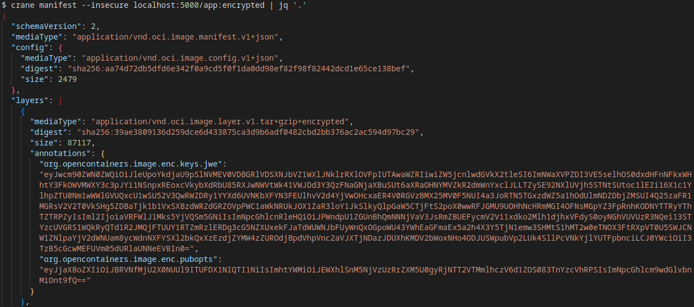

## OCICrypt Container Image KMS Provider

Basic [OCICrypt KeyProvider](https://github.com/containers/ocicrypt/blob/main/docs/keyprovider.md) for KMS (GCP only for now, AWS, Azure would be pretty easy to add).

This repo includes a prebuilt and customizeable keyprovider which can be used to encrypt OCI Containers.

[OCICrypt](https://github.com/containers/ocicrypt) includes specifications to encrypt an OCI Container image and within that, the keyprovider protocol allows wrapping of the actual key used to encrypt the layer to an external binary.

The binary in this question accepts a keyprovider request and inturn wraps the layer symmetric encryption key using a hosted KMS key.

Basically, KMS wraps the symmetric key that is used to encrypt the layer itself.

This sample is based off of the [simple-oci-keyprovider](https://github.com/lumjjb/simple-ocicrypt-keyprovider.git) repo which demonstrates the protocol involved.

For more information, see 

- [Advancing container image security with encrypted container images](https://developer.ibm.com/articles/advancing-image-security-encrypted-container-images/)
- [Enabling advanced key usage and management in encrypted container images](https://developer.ibm.com/articles/enabling-advanced-key-usage-and-management-in-encrypted-container-images/)
- [Container Image Encryption & Decryption in the CoCo project](https://medium.com/kata-containers/confidential-containers-and-encrypted-container-images-fc4cdb332dec)

Note, for KMS and other systems, you can also use built in [PKCS11 support](https://github.com/containers/ocicrypt/blob/main/docs/pkcs11.md).  If you are interested in using a `Trusted Platform Module` as the root encryption source, see [Container Signing with Cosign and TPM PKCS-11](https://blog.salrashid.dev/articles/2022/cosign_tpm/) and [PKCS 11 Samples in Go using SoftHSM](https://github.com/salrashid123/go_pkcs11).


Anyway, this repo shows basic OCI container encryption and then an example with GCP KMS as the key wrapping provider.

* [Setup Baseline](#setup-baseline)
* [Setup Binary OCI KMS provider](#setup-binary-oci-kms-provider)
* [Setup gRPC OCI KMS provider](#setup-grpc-oci-kms-provider)



---

## Setup Baseline

- Install [skopeo](https://github.com/containers/skopeo/blob/main/install.md), [crane](https://github.com/google/go-containerregistry/blob/main/cmd/crane/README.md), docker

```bash
$ skopeo --version
skopeo version 1.12.1

$ crane version
v0.14.0
```

- Start local registry
```bash
cd example

docker run  -p 5000:5000 -v `pwd`/certs:/certs \
  -e REGISTRY_HTTP_TLS_CERTIFICATE=/certs/localhost.crt \
  -e REGISTRY_HTTP_TLS_KEY=/certs/localhost.key  docker.io/registry:2
```

- Build app

Save to local docker-daemon

```bash
docker build -t app:server .
```

- Copy image without encryption to registry

```bash
ce example/
export SSL_CERT_FILE=certs/tls-ca-chain.pem

skopeo copy   docker-daemon:app:server  docker://localhost:5000/app:server

skopeo inspect  docker://localhost:5000/app:server

crane manifest localhost:5000/app:server | jq '.'
```

- (optionally) create new certs 

Or you can just use the ones here

```bash
openssl genrsa -out certs/private.pem 2048
openssl rsa -in certs/private.pem -pubout -out certs/public.pem
openssl genrsa -out certs/wrongkey.pem 2048
```

- Test Encryption (all layers)

The following will encrypt all the layers using a local RSA key

```bash
export SSL_CERT_FILE=certs/tls-ca-chain.pem

skopeo copy  \
  --encryption-key jwe:./certs/public.pem docker-daemon:app:server docker://localhost:5000/app:encrypted

# inspect
crane manifest localhost:5000/app:encrypted | jq '.'

# load with incorrect key
## this will show "no suitable key unwrapper found or none of the private keys could be used for decryption"
skopeo copy \
  --decryption-key certs/wrongkey.pem docker://localhost:5000/app:encrypted docker://localhost:5000/app:decrypted

# load with correct key
skopeo copy \
  --decryption-key certs/private.pem docker://localhost:5000/app:encrypted docker://localhost:5000/app:decrypted

crane manifest localhost:5000/app:encrypted | jq '.'

crane manifest  localhost:5000/app:decrypted | jq '.'
```

```json
crane manifest --insecure localhost:5000/app:encrypted | jq '.'

{
  "schemaVersion": 2,
  "mediaType": "application/vnd.oci.image.manifest.v1+json",
  "config": {
    "mediaType": "application/vnd.oci.image.config.v1+json",
    "digest": "sha256:aa74d72db5dfd6e342f0a9cd5f0f1da0dd98ef82f98f82442dcd1e65ce138bef",
    "size": 2479
  },
  "layers": [
    {
      "mediaType": "application/vnd.oci.image.layer.v1.tar+gzip+encrypted",
      "digest": "sha256:39ae3809136d259dce6d433875ca3d9b6adf0482cbd2bb376ac2ac594d97bc29",
      "size": 87117,
      "annotations": {
        "org.opencontainers.image.enc.keys.jwe": "eyJwcm90ZWN0ZWQiOiJleUpoYkdjaU9pSlNVMEV0VDBGRlVDSXNJbVZ1WXlJNklrRXlOVFpIUTAwaWZRIiwiZW5jcnlwdGVkX2tleSI6ImNWaXVPZDI3VE5selhOS0dxdHFnNFkxWHhtY3FkOWVMWXY3c3pJYi1NSnpxREoxcVkybXdRbU85RXJwNWVtWk41VWJDd3Y3QzFNaGNjaXBuSUt6aXRaOHNYMVZkR2dmWnYxclJLLTZySE92NXlUVjh5STNtSUtoc1lEZi16X1c1YlhpZTU0Nm1wWWlGVUQxcU1wSU52V3QwRWZDRy1YYXd6UVNKbXFYN3FEUlhvV2d4YjVwOHcxaER4V0RGVzBMX25MV0F5NUI4a3JoRTN5TGxzdWZ5a1hOdUlmNDZDbjZMSUI4Q25zaFR1MGRsV2V2T0VkSHg5ZDBaTjk1b1VxSXBzdWRZdGRZOVpPWC1aWkNRUkJOX1ZaR3loY1JkSlkyQlpGaW5CTjFtS2poX0wwRFJGMU9UOHhNcHRmMGI4OFNsMGpYZ3FpRnhKODNYTTRyYThTZTRPZyIsIml2IjoiaVRFWlJ1Mks5YjVQSm5GNiIsImNpcGhlcnRleHQiOiJPWndpU1ZGUnBhQmNNNjVaV3JsRmZBUEFycmV2Vi1xdko2Mlh1djhxVFdyS0oyNGhVUVUzR3NQei13STYzcUVGRS1WQkRyQTd1R2JMQjFTUUY1RTZmRzlERDg3cG5NZXUxekFJaTdWUWNJbFUyWnQxOGpoWU43YWhEaGFmaEx5a2h4X3Y5TjN1emw3SHMtS1hMT2w0eTNOX3FtRXpVT0U5SWJCNW1ZNlpaYjV2dWNUam8ycWdnNXFYSXl2bkQxXzEzdjZYMW4zZUROdjBpdVhpVnc2aVJXTjNDazJDUXhKMDV2bWoxNHo4ODJUSWpubVp2LUk4SllPcVNkYjlYUTFpbnciLCJ0YWciOiI3TzB5cGcwMEFUVm05dURlaUNNeEVBIn0=",
        "org.opencontainers.image.enc.pubopts": "eyJjaXBoZXIiOiJBRVNfMjU2X0NUUl9ITUFDX1NIQTI1NiIsImhtYWMiOiJEWXhlSnM5NjVzUzRrZXM5U0gyRjNTT2VTMmlhczV6d1ZOS083TnYzcVhRPSIsImNpcGhlcm9wdGlvbnMiOnt9fQ=="
      }
    },
```

where the payload of `org.opencontainers.image.enc.keys.jwe` includes the wrapped key and specifications:

```json
{
  "protected": "eyJhbGciOiJSU0EtT0FFUCIsImVuYyI6IkEyNTZHQ00ifQ",
  "encrypted_key": "cViuOd27TNlzXNKGqtqg4Y1Xxmcqd9eLYv7szIb-MJzqDJ1qY2mwQmO9Erp5emZN5UbCwv7C1MhccipnIKzitZ8sX1VdGgfZv1rRK-6rHOv5yTV8yI3mIKhsYDf-z_W5bXie546mpYiFUD1qMpINvWt0EfCG-XawzQSJmqX7qDRXoWgxb5p8w1hDxWDFW0L_nLWAy5B8krhE3yLlsufykXNuIf46Cn6LIB8CnshTu0dlWevOEdHx9d0ZN95oUqIpsudYtdY9ZOX-ZZCQRBN_VZGyhcRdJY2BZFinBN1mKjh_L0DRF1OT8xMptf0b88Sl0jXgqiFxJ83XM4ra8Se4Og",
  "iv": "iTEZRu2K9b5PJnF6",
  "ciphertext": "OZwiSVFRpaBcM65ZWrlFfAPArrevV-qvJ62Xuv8qTWrKJ24hUQU3GsPz-wI63qEFE-VBDrA7uGbLB1SQF5E6fG9DD87pnMeu1zAIi7VQcIlU2Zt18jhYN7ahDhafhLykhx_v9N3uzl7Hs-KXLOl4y3N_qmEzUOE9IbB5mY6ZZb5vucTjo2qgg5qXIyvnD1_13v6X1n3eDNv0iuXiVw6iRWN3Ck2CQxJ05vmj14z882TIjnmZv-I8JYOqSdb9XQ1inw",
  "tag": "7O0ypg00ATVm9uDeiCMxEA"
}
```

- Verify pulling encrypted vs unencrypted images

Try pulling 'back' the encrypted image to the local docker-daemon with and without encryption

```bash
$ docker pull localhost:5000/app:server
Status: Downloaded newer image for localhost:5000/app:server
localhost:5000/app:server

$ docker pull localhost:5000/app:encrypted
failed to register layer: Error processing tar file(exit status 1): unexpected EOF

$ docker pull localhost:5000/app:decrypted
Status: Downloaded newer image for localhost:5000/app:decrypted
localhost:5000/app:decrypted
```

- Test Encryption (last layer)

Now do the same as above but encrypt just the last layer

```bash
cd example/
export SSL_CERT_FILE=certs/tls-ca-chain.pem

skopeo copy \
  --encryption-key jwe:./certs/public.pem docker-daemon:app:server  docker://localhost:5000/app:encrypted
  
skopeo copy \
  --decryption-key certs/private.pem docker://localhost:5000/app:encrypted docker://localhost:5000/app:decrypted

skopeo inspect docker://localhost:5000/app:encrypted

crane manifest localhost:5000/app:encrypted | jq '.'
crane manifest localhost:5000/app:decrypted | jq '.'
```

Note that the last layer will include encryption attributes:

```json
{
  "protected": "eyJhbGciOiJSU0EtT0FFUCIsImVuYyI6IkEyNTZHQ00ifQ",
  "encrypted_key": "LmJHXG7Phd6Mmmi9JrxWtuURtg7iTquIbvEIjcWmpnOB2WCaRwjLqaqbcADYQZEgpHLvVoYWAkY39YVssCeQ0IlaPosE4n1ADjuPzrS8S5w7rNkfBXkUkM8_5ViD9QwWBikb-hsIfA141jMEEEeipWCRuQoPwA3S-ecZJlyiW9XfCQP3eT9MktHS_QHrpPHRmnQMXrnk1HdYHsPSpgPSA3AonooLD1CxCOi1G4sicapiFQhmmQVSx5wxVfS3xs00En6xB31wUqYrujUwd5fcyFyr7HdLeZFR9oaYO56fQyGmjeFsuZTSmRkWWNBUgaflxJIR5F5qZ7bFSKRhEW2kSA",
  "iv": "IyvBirI825aPOhgD",
  "ciphertext": "nMKFuLGcUd_uiXX8aEbNSHXu4a2Y60qs-iTmLHqnbFFyck_BbXKDhVnbVNzdn3fHbt5ToMuwClJFwzvw3uCQsB073dv0hCNPUG6xwih3RC9-wvFbjBjdUarkloqBqyGy7R4Tk6-XjRB8wde0ft6zfAnAEhh-js5eLbeodT0PDu0sJ1_kXBNKDa81GUkIUrkSu_BwTkvK8B0c_Az4Vnu4-PHQUq-BjGZT8OsXDD27S1P2mxo22sR3hoAgpRjkSqvjLA",
  "tag": "sny3PJZqJcA5nzjJkCY3tA"
}
```

## Setup Binary OCI KMS provider

First create a KMS Key to use

```bash
export PROJECT_ID=`gcloud config get-value core/project`
export PROJECT_NUMBER=`gcloud projects describe $PROJECT_ID --format='value(projectNumber)'`
export GCLOUD_USER=`gcloud config get-value core/account`

gcloud auth application-default login

gcloud kms keyrings create ocikeyring --location=global

gcloud kms keys create key1 --keyring=ocikeyring  --location=global --purpose=encryption

# this is unnecessary since you should already have permissions
gcloud kms keys add-iam-policy-binding key1    \
    --keyring=ocikeyring --location=global \
     --member="user:$GCLOUD_USER" --role=roles/cloudkms.cryptoKeyEncrypterDecrypter
```

- Build plugin

(or download the binary from the "releases" page)

```bash
cd plugin
go build -o kms_oci_crypt .
```

- Test binary provider

Edit `example/ocicrypt.json` and enter the full path to the binary:

```json
{
    "key-providers": {
      "kmscrypt": {
        "cmd": {
          "path": "/full/path/to/kms_oci_crypt",
          "args": []
        }
      }
    }
}
```

Then specify the path to this file

```bash
export OCICRYPT_KEYPROVIDER_CONFIG=/full/path/to/ocicrypt.json
```

Finally test encryption and decryption:

```bash
cd example/
export SSL_CERT_FILE=certs/tls-ca-chain.pem


skopeo copy \
  --encryption-key=provider:kmscrypt:gcpkms://projects/$PROJECT_ID/locations/global/keyRings/ocikeyring/cryptoKeys/key1 \
   docker-daemon:app:server docker://localhost:5000/app:encrypted

skopeo copy \
  --decryption-key=provider:kmscrypt:gcpkms://projects/$PROJECT_ID/locations/global/keyRings/ocikeyring/cryptoKeys/key1 \
    docker://localhost:5000/app:encrypted docker://localhost:5000/app:decrypted
```


Finally, you can specify the path GCP `Application Default Credentials` file by setting the startup argument `--adc`.  You can use this setting to direct the GCP encryption to use [Workload Identity Federation](https://cloud.google.com/iam/docs/workload-identity-federation)

```json
{
  "key-providers": {
    "kmscrypt": {
      "cmd": {
        "path": "/path/to/kms_oci_crypt",
        "args": [
          "--adc=/path/to/application_default_credentials.json"
        ]
      }
    }
  }
}
```

### Setup gRPC OCI KMS provider

Included in this repo is a grpc service which you can use as the key provider.

Basically, its the same as calling the binary except that it calls a gRPC server you run separately.

Note, the existing implementation _does not use TLS_!.  You would definitely want to secure access to this service.

To use, start the server

```bash
cd grpc

go run server.go
```

set the `OCICRYPT_KEYPROVIDER_CONFIG` file to use

```json
{
  "key-providers": {
    "kmscrypt": {
      "cmd": {
        "path": "/path/to/kms_oci_crypt",
        "args": []
      }
    },
    "grpc-keyprovider": {
      "grpc": "localhost:50051"
    }
  }
}
```

Finally invoke the endpoints (note `provider:grpc-keyprovider` is used below)

```bash
cd example/
export SSL_CERT_FILE=certs/tls-ca-chain.pem

skopeo copy --encrypt-layer -1 \
  --encryption-key=provider:grpc-keyprovider:gcpkms://projects/$PROJECT_ID/locations/global/keyRings/ocikeyring/cryptoKeys/key1 \
   docker-daemon:app:server docker://localhost:5000/app:encrypted

skopeo copy --dest-tls-verify=false \
  --decryption-key=provider:grpc-keyprovider:gcpkms://projects/$PROJECT_ID/locations/global/keyRings/ocikeyring/cryptoKeys/key1 \
    docker://localhost:5000/app:encrypted docker://localhost:5000/app:decrypted
```

